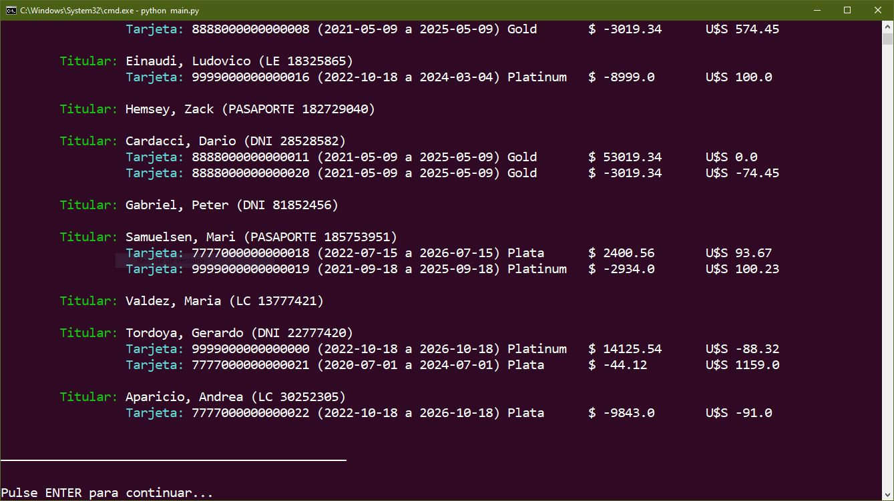

# Sobre la visualización de este programa en consola

Como puede verse en la imagen, el programa ofrece mucho en términos de visualización:

Ya otros compañeros hicieron observaciones en cuanto a la pobreza de visualización que ofrece la consola ejecutada desde el IDE de Visual Studio, por lo que se recomienda ejecutar el programa (como se hizo al momento de la captura) desde la consola de comandos del SO.

Incluso en la consola de VSCode se puede ver nítidamente.
